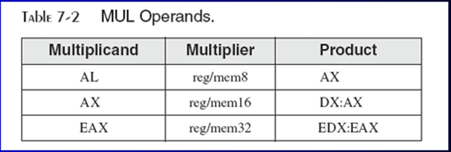
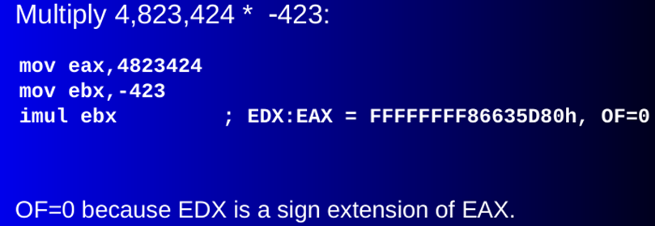
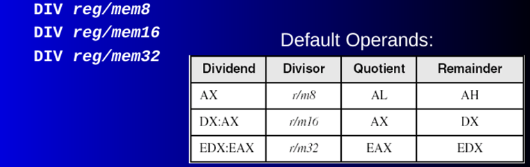
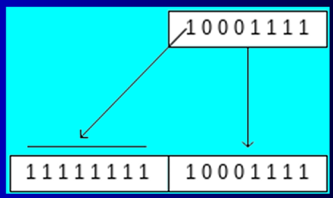

# Chapter 7: Phép toán số nguyên

- [Chapter 7: Phép toán số nguyên](#chapter-7-phép-toán-số-nguyên)
    - [I. Shift and Rotate Instructions](#i-shift-and-rotate-instructions)
      - [1. Logical vs Arithmetic Shifts.](#1-logical-vs-arithmetic-shifts)
      - [2. SHL](#2-shl)
      - [3. SHR](#3-shr)
      - [4. SAL và SAR](#4-sal-và-sar)
      - [5. ROL](#5-rol)
      - [6. ROR](#6-ror)
      - [7. RCL và RCR](#7-rcl-và-rcr)
      - [8. SHLD/ SHRD](#8-shld-shrd)
    - [II. Ứng dụng](#ii-ứng-dụng)
      - [1. Dịch nhiều từ kép](#1-dịch-nhiều-từ-kép)
      - [2. Nhân số nhị phân](#2-nhân-số-nhị-phân)
      - [3. Hiển thị bit nhị phân](#3-hiển-thị-bit-nhị-phân)
      - [4. Cô lập 1 chuỗi bit](#4-cô-lập-1-chuỗi-bit)
    - [III. Nhân và chia](#iii-nhân-và-chia)
      - [1. MUL](#1-mul)
      - [2. IMUL](#2-imul)
      - [3. DIV](#3-div)
      - [4. Chia số nguyên có dấu](#4-chia-số-nguyên-có-dấu)
      - [5. CBW, CWD, CDQ](#5-cbw-cwd-cdq)
      - [6. IDIV](#6-idiv)
    - [IV. Cộng và trừ mở rộng (không áp dụng cho chương trình 64-bit)](#iv-cộng-và-trừ-mở-rộng-không-áp-dụng-cho-chương-trình-64-bit)
      - [1. ADC](#1-adc)
      - [2. SBB](#2-sbb)
    - [V. ASCII và số thập phân không đóng gói (không áp dụng cho chương trình 64-bit)](#v-ascii-và-số-thập-phân-không-đóng-gói-không-áp-dụng-cho-chương-trình-64-bit)
      - [1. AAA](#1-aaa)
      - [2. AAS](#2-aas)
      - [3. AAM](#3-aam)
      - [4. AAD](#4-aad)
    - [VI. Packed Decimal Arithmetic](#vi-packed-decimal-arithmetic)

### I. Shift and Rotate Instructions
#### 1. Logical vs Arithmetic Shifts.
- Logical shift: 1 phép dịch chuyển logic sẽ lấp đầy vị trí bit mới được tạo bằng số 0.
- Arithmetic shift: 1 phép dịch chuyển số học sẽ lấp đầy vị trí bit mới được tạo với 1 bản sao của bit dấu.
#### 2. SHL
- SHL (shift left): dịch các bit của toán hạng sang trái, điền bit mới bên phải bằng 0.
- Cú pháp: 	SHL des, count			(count: số lượng bit cần dịch)
- Dịch chuyển sang trái n bits sẽ nhân toán hạng với 2n.
#### 3. SHR
- SHR (shift right): dịch các bit của toán hạng sang phải, điền bit mới bên trái bằng 0.
- Cú pháp: 	SHR des, count			(count: số lượng bit cần dịch)
- Dịch chuyển sang phải n bits sẽ chia toán hạng cho 2n.
#### 4. SAL và SAR
- SAL: tương tự SHL
- SAR: dịch các bit của toán hạng sang phải và giữ nguyên bit dấu. Tương tự SHR.
#### 5. ROL
- ROL (rotate left): xoay các bit của toán hạng sang trái, các bit bị dịch ra ngoài bên trái quay lại vào bên phải.
- Cú pháp: 	ROL des, count
#### 6. ROR
- ROR (rotate right): xoay các bit của toán hạng sang phải, các bit bị dịch ra ngoài bên phải sẽ quay lại vào bên trái.
- Cú pháp: 	ROR des, count
#### 7. RCL và RCR
- RCL: xoay các bit của toán hạng sang trái qua CF, các bit bị dịch ra ngoài bên trái sẽ được đưa vào CF và bit từ CF sẽ được đưa vào bên phải toán hạng.
	RCL des, count
- RCR: xoay các bit của toán hạng sang phải qua CF, các bit bị dịch ra ngoài bên phải sẽ được đưa vào CF và bit từ CF sẽ được đưa vào bên trái toán hạng.
	RCR des, count
#### 8. SHLD/ SHRD
- SHLD: dịch các bit của toán hạng đích sang trái. Các vị trí bit trống sẽ được lấp đầy bởi các bit quan trọng nhất của toán hạng nguồn. Toán hạng nguồn không bị ảnh hưởng.
	SHLD destination, source, count
- SHRD: dịch các bit của toán hạng đích sang phải. Các vị trí bit trống sẽ được lấp đầy bởi các bit ít quan trọng nhất của toán hạng nguồn. Toán hạng nguồn không bị ảnh hưởng.
	SHRD destination, source, count
### II. Ứng dụng
#### 1. Dịch nhiều từ kép
#### 2. Nhân số nhị phân
#### 3. Hiển thị bit nhị phân
#### 4. Cô lập 1 chuỗi bit
### III. Nhân và chia
#### 1. MUL
- Ở 32-bit, MUL (nhân không dấu) nhân toán hạng 8, 16 hoăc 32-bit với thanh ghi AL, AX, EAX. 
- Cú pháp: 	MUL reg/mem(8, 16, 32)
 

#### 2. IMUL
- IMUL (nhân có dấu): nhân toán hạng 8, 16 hoăc 32-bit với thanh ghi AL, AX, EAX. 
- Duy trì dấu của tích bằng cách mở rộng dấu vào nửa phần trên của des.
 
 

#### 3. DIV	
- DIV (chia không dấu): thực hiện phép chia nguyên giữa các thanh ghi AX, DX:AX, EDX:EAX với 1 toán hạng, kết quả lưu vào thanh ghi tương ứng.
- 1 toán hạng được cung cấp (reg/mem) được coi là số chia.
 
 

#### 4. Chia số nguyên có dấu
- Số nguyên có dấu phải được mở rộng phần dấu trước khi chia: điền vào các byte,word,dw cao bằng 1 bản sao bit dấu của byte,word,dw thấp.
  
  

#### 5. CBW, CWD, CDQ
- Là các lệnh mở rộng dấu, dùng để chuyển đổi giá trị từ 8 lên 16 hoặc từ 16 lên 32, duy trì dấu trong quá trình mở rộng.
	+ CBW (byte to word): mở rộng AL thành AH.
	+ CWD (word to dw): mở rộng AX thành DX.
	+ CDQ (dw to qw): mở rộng EAX thành EDX. 
#### 6. IDIV
- IDIV (chia có dấu), tương tự DIV.
- Số dư và số bị chia luôn luôn cùng dấu.
- Tất cả các cờ trạng thái sẽ không xác định.
### IV. Cộng và trừ mở rộng (không áp dụng cho chương trình 64-bit)
#### 1. ADC
- ADC (cộng có nhớ): cộng nguồn với nội dung của CF tới đích.
- Toán hạng là các giá trị nhị phân. Cú pháp giống ADD, SUB.
#### 2. SBB
- SBB (trừ có nhớ): trừ cả nguồn và CF khỏi đích.
- Cú pháp giống ADC.
### V. ASCII và số thập phân không đóng gói (không áp dụng cho chương trình 64-bit)
#### 1. AAA
- Điều chỉnh kết quả nhị phân của ADD hoặc ADC, làm cho kết quả trong AL giống với biểu diễn ASCII.
#### 2. AAS
- Điều chỉnh kết quả nhị phân của SUB hoặc SBB, làm cho kết quả trong AL giống với biểu diễn ASCII.
#### 3. AAM
- Điều chỉnh kết quả nhị phân của MUL, phép nhân phải được thực hiện trên số BCD đã giải nén.
#### 4. AAD
- Điều chỉnh số bị chia BCD chưa đóng gói trong AX trước khi chia.
### VI. Packed Decimal Arithmetic
- Mỗi byte được dung để lưu trữ 2 chữ số thập phân, mỗi chữ số mã hóa bằng 4 bit.
- DAA (điều chỉnh thập phân sau phép cộng): chuyển đổi kết quả nhị phân của ADD hoặc ADC sang thập phân.
- DAS (điều chỉnh thập phân sau phép trừ): chuyển đổi kết quả nhị phân của SUB hoặc SBB sang thập phân.